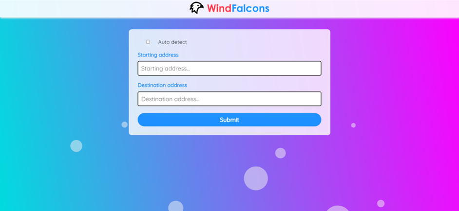
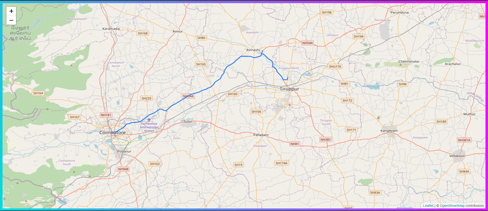
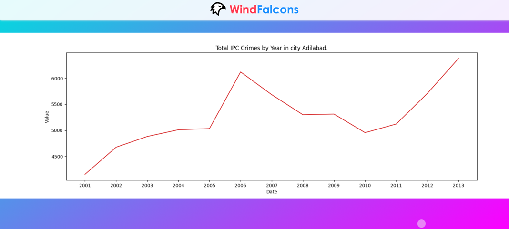

# Data Science: Crime Analysis and Safety Recommendation
# Team Name: Wind Falcons
### 🌟	Overview 
💫 First we perform exploratory data analysis on the given crime data then this data will be exported into the database for querying purposes. Then we use a standard navigation API to get the start(A) and end(B) destination thus we get the route from the point A to B. Now we get the reverse latitude from the points present in between A and B. For each and every point we perform caching so as to increase performance. Now that we got the latitude for every intermediate point we also have to get the crime’s location’s latitude. We perform K nearest neighbors for each point then display the results and ask for the user to change route if the route found has more crime as compared to other paths. 

### 🌟	Implementation details 
💫 The major features are that the analysis obtained can be further be displayed to the user like each crime in the intermediate area sorted based upon the recent to the oldest one. Tips for user to prevent the crime. Re-route if crime are less in alternative route. As we use K nearest neighbor instead of dijkstra for decreasing complexity. We use caching for every route until the database is updated/added by the admin. So this reduces complexity by a lot.

### 🌟	Tools & Technologies 
💫 Python as the implementation language. Openrouteservice’s api for getting the Direction between two points (i.e) source and destination.  openstreetmap and requests for the location to latitude and longitude conversion.  K nearest points’s Algorithm for finding the closest crime for each intermediate point. Flask is to be used for web based application.

### 🌟	Image 1
 
Starting Page of the Project. User needs to enter the starting and destination address.
 

### 🌟	Image 2
 
Displays the shortest route first, then it reroutes to the alternative routes which has less crime occurence rate.
 

### 🌟	Image 3
 
Plotted the predicted analysis. 

#### Still Implementing
💫 Rerouting as per the crime rate. 
💫 Displaying the maximum crime that has occured in the particular region. 

#### Team Members
💫  20I224 - Kaushik S 
💫  21I433 - Janathsri Krishnan K 
💫  21I437 - Mohamed Fazil Z 